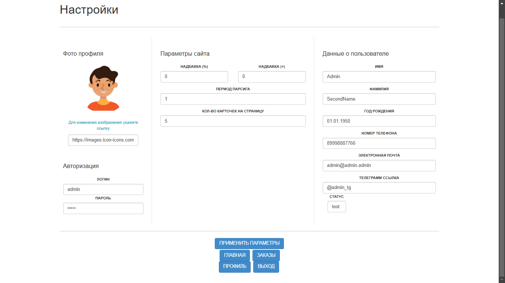
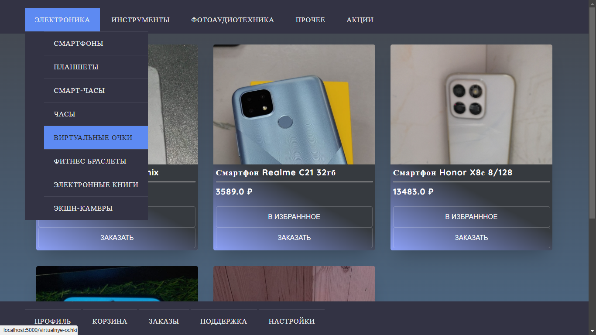

# e-shop

internet-shop

> Requires

---

> Settings and config

---

> Redis setup

https://timeweb.cloud/tutorials/redis/ustanovka-i-nastrojka-redis-dlya-raznyh-os

> Launch

```bash
cd e-shop
python app.py
```

---

> Demo screen
> Web-interface

---



